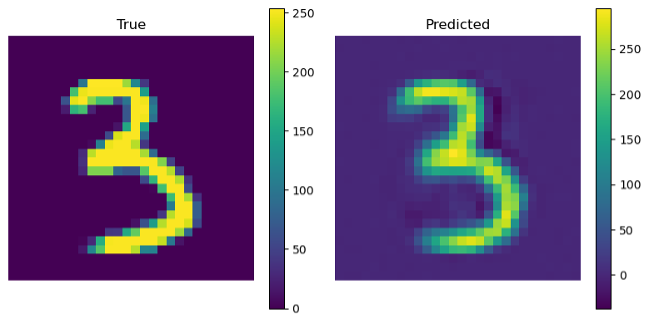

# FNN-inverse-prediction
FNN model for mechanical MNIST inverse prediction
# Core Functionality

MNIST_inverse.py trains a fully connected neural network (FNN) to learn the inverse mapping from FEA displacement fields to MNIST-like 28×28 images and saves a trained model checkpoint for later use. The input consists of concatenated x- and y-displacement features, which are separately normalized using training-set statistics before being fed into the network. The model is trained using mean absolute error (MAE) loss, and the best-performing weights on the test set are retained.

The primary purpose of this script is model training and checkpoint generation only. After training, the script saves a .pt file containing the trained model weights together with the normalization parameters required for consistent inference. A simple visualization of one test prediction is included as a sanity check, but this file is not intended to be the main interface for using the model.

To use the trained model for inference and visualization, please refer to Model_demo.py, which demonstrates how to load the saved checkpoint, apply the same normalization, and visualize predicted images from new or test displacement inputs.

Here is an example of y_true (an original Mechanical MNIST number) and y_pred (predicted from displacement fields)

